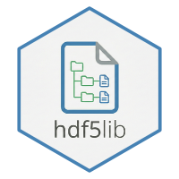

# **HDF5 C Library for R** 

[](https://CRAN.R-project.org/package=hdf5lib)
[](https://anaconda.org/conda-forge/r-hdf5lib)

`hdf5lib` is an R package that provides a self-contained, static build of the [HDF5 C library](https://www.hdfgroup.org/solutions/hdf5/) ([release 2.0.0](https://github.com/HDFGroup/hdf5)). Its **sole purpose** is to allow other R packages to easily link against HDF5 without requiring users to install system-level dependencies, thereby ensuring a consistent and reliable build process across all major platforms.

This package provides **no R functions** and is intended for R package developers to use in the `LinkingTo` field of their `DESCRIPTION` file.


## Features

-   **Portable & Self-Contained:** Builds the HDF5 library from source using only standard R build tools. This ensures your package works "out of the box" on any system without requiring pre-installed libraries or administrative privileges.

-   **Comprehensive API Coverage:** Provides access to the complete core HDF5 v2.0.0 library, including both the **Low-Level** and **High-Level** C APIs.

    -   **Compression & Filters:** Built-in support for `gzip/deflate` via bundled zlib and support for external filter plugins (e.g., Blosc, LZ4).
    -   **Modern Features:** Includes native complex number support and improved UTF-8 handling on Windows.

-   **Flexible API Versioning:** Downstream packages can compile against specific HDF5 API versions (e.g., 2.0, 1.14, 1.12). This allows you to lock your package to a specific API, ensuring future `hdf5lib` updates won't break your build.

-   **Safe for Parallel Code:** Compiled with thread-safety enabled to prevent data corruption when using multi-threaded frameworks like `RcppParallel`. *You must still use a file locking mechanism if (1) you use the High-Level (HL) APIs, which are not thread-safe, or (2) you are accessing the file from multiple processes rather than multiple threads.*


## **Installation**

You can install the released version of `hdf5lib` from CRAN with:

``` r
install.packages("hdf5lib")
```

Alternatively, you can install the development version from GitHub:

``` r
# install.packages("pak")  
pak::pak("cmmr/hdf5lib")
```

**Note:** As this package builds the HDF5 library from source, the one-time installation may take several minutes. ⏳


## **Usage (For Developers)**

To use this library in your own R package, you need to add `hdf5lib` to `LinkingTo`, create a `src/Makevars` file to link against its static library, and then include the HDF5 headers in your C/C++ code.


### **1. Update your `DESCRIPTION` file**

Add `hdf5lib` to the `LinkingTo` field.

``` yaml
Package: myrpackage  
Version: 0.1.0  
...  
LinkingTo: hdf5lib
```

This step ensures the R build system can find the HDF5 header files in `hdf5lib`.


### **2. Create `src/Makevars`**

Create a file named `Makevars` inside your package's `src/` directory. This tells the build system how to find and link your package against the static HDF5 library. You can optionally use the `api` parameter to lock in a specific HDF5 API version (e.g., 2.0, 1.14, 1.12, 1.10, 1.8, 1.6) to prevent future updates to HDF5 from breaking your package.

Add the following lines to `src/Makevars`:

``` makefile
PKG_CPPFLAGS = `$(R_HOME)/bin/Rscript -e "cat(hdf5lib::c_flags(api = 2.0))"`
PKG_LIBS     = `$(R_HOME)/bin/Rscript -e "cat(hdf5lib::ld_flags(api = 2.0))"`
```

*(Note: You only need this one `src/Makevars` file. The R build system on Windows will use `src/Makevars.win` if it exists, but will fall back to using `src/Makevars` if it's not found. Since these commands are platform-independent, this single file works for all operating systems.)*


### **3. Include Headers in Your C/C++ Code**

You can now include the HDF5 headers directly in your package's `src` files.

``` c
#include <R.h>  
#include <Rinternals.h>

// Include the main HDF5 header  
#include <hdf5.h>

// Optionally include the High-Level header for H5LT etc.  
#include <hdf5_hl.h>

SEXP read_my_hdf5_data(SEXP filename) {  
    hid_t file_id;  
    const char *fname = CHAR(STRING_ELT(filename, 0));

    // Call HDF5 functions directly  
    file_id = H5Fopen(fname, H5F_ACC_RDONLY, H5P_DEFAULT);

    // ... your code using HDF5 APIs ...

    H5Fclose(file_id);  
    return R_NilValue;  
}
```


## **Included HDF5 APIs**

This package provides access to the **complete core HDF5 C API** (v2.0.0). Developers have full access to all standard functions, macros, and types for local file I/O, metadata management, and data manipulation.

> **Note:** To maintain a zero-dependency footprint, optional features requiring external system libraries - such as Parallel HDF5 (MPI), HDFS, and S3 support - are not included.

While the **full core API** is available, the following highlights represent the most commonly used modules:


### **High-Level (HL) APIs (Simplified wrappers)**

The HL APIs provide "lite" versions of complex operations, making it significantly easier to perform common tasks without manual memory or hyperslab management.

- **H5LT (Lite):** Simplified dataset and attribute operations (e.g., `H5LTmake_dataset_int`, `H5LTread_dataset_double`, `H5LTget_dataset_info`).
- **H5IM (Image):** Standardized functions for working with image data (e.g., `H5IMmake_image_24bit`, `H5IMread_image`).
- **H5TB (Table):** Functions for creating and manipulating tabular data structures (e.g., `H5TBmake_table`, `H5TBappend_records`).


### **Low-Level APIs (Comprehensive core functionality)**

The package exposes the **full range** of core HDF5 modules for fine-grained control over file structure, metadata, and raw I/O:

- **H5F (File):** Manage file lifecycle (`H5Fcreate`, `H5Fopen`, `H5Fclose`, etc.).
- **H5G (Group):** Organize objects within a file (`H5Gcreate2`, `H5Gopen2`, `H5Gclose`, etc.).
- **H5D (Dataset):** Manage raw data arrays and I/O (`H5Dcreate2`, `H5Dread`, `H5Dwrite`, etc.).
- **H5S (Dataspace):** Define data dimensions and selections (`H5Screate_simple`, `H5Sselect_hyperslab`, etc.).
- **H5T (Datatype):** Define and manage data types (e.g., `H5T_NATIVE_INT`, `H5Tcopy`, `H5Tinsert`).
- **H5A (Attribute):** Manage metadata attached to objects (`H5Acreate2`, `H5Aread`, `H5Awrite`).
- **H5P (Property List):** Configure library behavior, such as chunking or compression (`H5Pcreate`, `H5Pset_chunk`).

> **Note:** For a complete list of all available functions, please refer to the official [HDF5 Reference Manual](https://support.hdfgroup.org/documentation/hdf5/latest/_r_m.html). Any function documented there can be called from your package after including the headers as shown above.


### **Looking for an R Interface?**

If you are looking for a high-level R interface rather than writing C/C++ code, check out the [**h5lite**](https://github.com/cmmr/h5lite) package. It uses `hdf5lib` under the hood to provide a fast, "no-nonsense" way to read and write HDF5 files directly from R with a single function call.


## **Relationship to `Rhdf5lib`**

The [`Rhdf5lib`](https://doi.org/doi:10.18129/B9.bioc.Rhdf5lib) package also provides the HDF5 C library. `hdf5lib` was created to provide a general-purpose, standalone HDF5 library provider that offers several key distinctions:

-   **Zero Configuration Installation:** `hdf5lib` is designed for simplicity. Installation via `install.packages()` requires no user configuration and reliably provides a modern HDF5 build with important features enabled by default. `Rhdf5lib`, while flexible, requires users to manage compile-time configuration options for a customized build.

-   **Modern HDF5 Version:** `hdf5lib` bundles HDF5 v2.0.0, providing access to the latest features and fixes, including native complex number support and improved UTF-8 handling on Windows. This is more recent than the version typically bundled in `Rhdf5lib` (v1.12.2 as of Bioconductor 3.19).

-   **Thread-Safety Enabled:** `hdf5lib` builds HDF5 with thread-safety enabled, ensuring safe use with parallel R packages (like `RcppParallel`). `Rhdf5lib` does not support building with this feature.

-   **Predictable Versioning and Features:** The version of `hdf5lib` directly corresponds to the bundled HDF5 version (e.g., `hdf5lib` v2.0.0.x bundles HDF5 v2.0.0). This allows developers to require a minimum `hdf5lib` version to guarantee a specific HDF5 version and a consistent set of features. In contrast, `Rhdf5lib` may link against a pre-existing system library or be configured at install-time, so its package version does not guarantee which version of HDF5 is actually in use or which features are enabled.

`hdf5lib` is intended to be a simple and reliable provider of the HDF5 C library for any R package.


## **License**

The `hdf5lib` package itself is available under the MIT license. The bundled HDF5 and zlib libraries are available under their own permissive licenses, as detailed in [inst/COPYRIGHTS](https://github.com/cmmr/hdf5lib/blob/main/inst/COPYRIGHTS).

*(Note: The zlib library is bundled internally but its headers are not exposed).*
